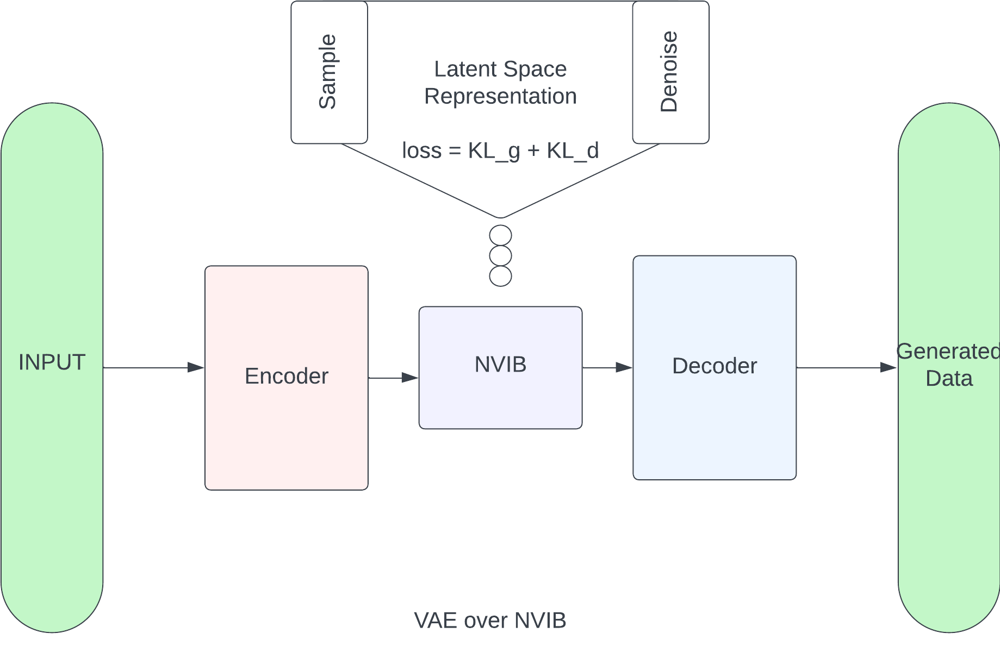

# VAE with NVIB

### Setup
Recommended

Python 3.11.5
Pytorch min 2.0
Jupiter NB

Open test.ipynb on Jupiter NB or text editor with Jupyter NB plugin and run all

 
 
 

## Flow Details

 
 

### Data cleanup, preprocessing and encoding
The data was cleaned up, removing irrelevant fields.

The data was also fitted and transformed using ordinal and scalar transformers from scikit-learn for categorical and numerical data respectively.

 
 

### The Encoder q(z|x)
The transformer encoder takes inputs of data x and gives for each Input x of size n, a distribution z or F as in paper, 
 

`mean parameter μ^q tensor of size 1*n`
 

`log(variance) parameter log(σ^q) tensor of size 1*n`
 

`alpha parameter α^q tensor of size 1*1`

 
 
 

### The Decoder q(x|z)
The transformer decoder takes distribution z (this was referred to a F in the paper) to reconstruct the input x.
 

during training: `F = Z tensor of size k * p and pie tensor of size k * 1`
 

after training: `F = output of encoder`
 

Decoder should access F using denoising attention instead of cross attention.

 
 
 

### The Information Bottleneck (NVIB)
With a set of parameters, the NVIB passes input data to `encoder`, `reparemeterises` and passes the output to the decoder.
This process becomes iterative for training and is called once for generation.
In the script that runs the training, the loss is calculated using KL_divergence which is `Lg + Ld`, an addition of gaussian and dirichlet losses. The expectation is that the KL_divergence (bottleneck loss) and the reconstruction loss should be minimized.

As part of the parameters of interest in this layer, prior and posterior data are taken into account. This is important because its improves performance. 

#### - Sampler
The sampler retains some form of memory and generates data from output of encoder by guessing some random parameters

#### - Reparameterization
This ensure backward propagation of the reconstruction error

### Loss Function
The KL_divergence as mentioned above is a represented by Lg + Ld, after the summation, the loss is taken into account and backward propagation happens. The aim is to minimize this as much as possible to improve the quality and `likeness` of the input `(x)` and reconstructed input `(x')`

 
 
 

### The Generator
The generator runs a single decode based on samples, this as mentioned above generates data and the constructed output gets inverse transformed from ordinal or scalar values.

